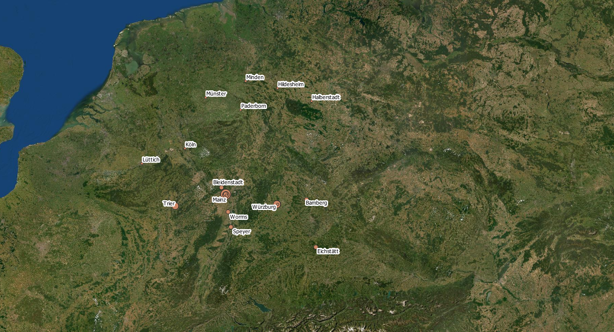
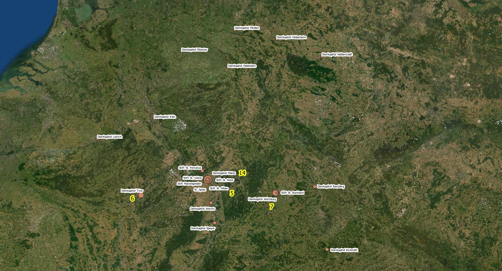

<h2>Places of swearing-in</h2>

<h4>Swearings-in (frequencies)</h4>

The map above shows the locations of all cathedral chapters and collegiate chapters where the cathedral provosts of the Mainz cathedral chapter were sworn in during their lives. The larger red location dots indicate the number of swearings-in recorded at the respective locations, regardless of the institutions involved. Place dots without numbers mean that only one swearing-in took place.
 

The <a href="https://ieg-dhr.github.io/DigiKAR_Projektseminar/information_EN.html">fourteen cathedral provosts</a> who were elected as cathedral provosts in the Mainz cathedral chapter between 1650 and 1817 were considered. In addition to the cathedral chapters in Mainz, Trier, Speyer, Bamberg, Worms, Würzburg, Eichsstätt, Hildesheim and Minden, the map depicts the swearing-in 
of individual cathedral provosts in various other monasteries. The map shows various swearing-in ceremonies in the area between Brunswick and Hanover in the 
north and Ingolstadt in the south, since none of the selected cathedral provosts was sworn in at chapters further south. The families of the 
cathedral provosts predominantly held the rank of imperial knights, which could be the reason for the low number of swearings-in at the cathedral chapter of 
Cologne and the lack of swearings-in in Strasbourg, where the rank of imperial count was a prerequisite for access.

The source and literature basis for research on the lives of the individual cathedral provosts varies considerably, but the places of swearings-in have been quite reliably handed down. The resources used for our research can be found in <a href="https://ieg-dhr.github.io/DigiKAR_Projektseminar/sources_EN">list of primary sources and research literature</a>.

<h4>Alternative mapping of places of all swearings-in</h4>

An alternative way of visualising the swearing-in is presented in this map of present-day Germany and neighbouring regions. This map also shows the locations of all the cathedral chapters, collegiate chapters, etc. where the 14 different clerics were sworn in during their lives. In contrast to the cut-out map (below), the core lands of the Holy Roman Empire are shown in their entirety. The lack of swearings-in in the north and south of the realm is relevant and must therefore be made visible. The size of the dots in this map stands for the frequency of the swearings-in carried out per institution. Therefore, cathedral chapters are distinguished from collegiate chapters, which leads to overlaps of institution points in Mainz and Würzburg.

 

The close-up map is virtually identical to map above but zoomed in so that a smaller region is shown. This is done for practical reasons - by zooming in, the different point sizes become clearer. Instead of place names, the names of participating institutions are given. In the case of institutions with a particularly large number of swearings-in, the specific number of events recorded is displayed:

 
 <ol>
    <li>Domkapitel Mainz: 14</li>
    <li>Domkapitel Würzburg: 7</li>
    <li>Domkapitel Trier: 6</li>
    <li>Stift St. Alban, Mainz: 5</li>
  </ol>
 

Individual monasteries including St. Alban are displayed in Mainz. The swearing-in of Adolph Hund von Saulheim in the monastery of St. Burkhard in Würzburg (April 1609) is also mapped as a separate point geometry. Aiming at a comprehensive interpretation of the research results, all maps should be used comparatively.

