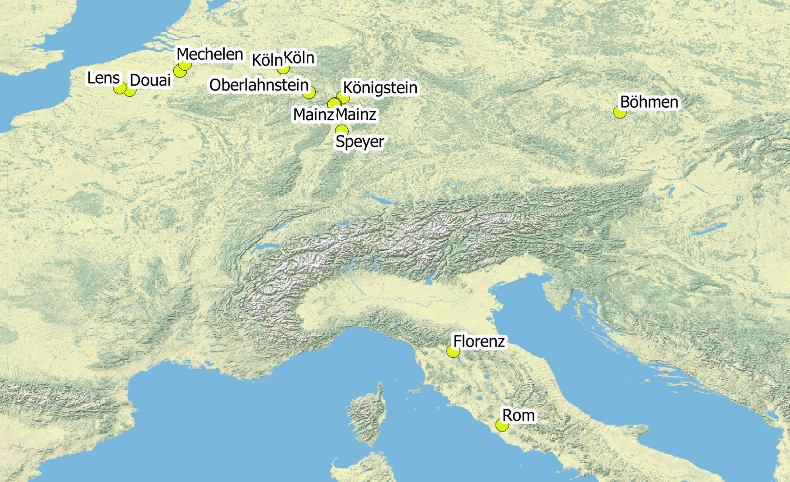

<h2>Vergleichende Kartierung mehrerer Biographien</h2>

Ein Ansatz zur vergleichenden Darstellung von Daten ist die kategorisierte oder regelbasierte Einfärbungen von Punktgeometrien.

Die obige Karte zeigt für jeden Domprobst biographisch relevante Orte in einer anderen Farbe. Während einige Kleriker vergleichsweise mobil waren und weit entfernt von Mainz studierten, die "Grand Tour" (Kavaliersreise) unternahmen oder in diplomatischer Mission unterwegs waren, konzentrierte sich das Leben anderer auf das Kurfürstentum Mainz oder sogar auf die nähere Umgebung der Stadt Mainz.

Ein Beispiel für einen mobileren Kleriker im analysierten Datensatz ist <strong>Dietrich Kaspar von Fürstenberg (*1615–†1675)</strong>, der sich in Florenz, Rom und Böhmen sowie an mehreren Orten im heutigen Belgien und Frankreich aufhielt.

<h2>Einzelkarten: Anzahl geistlicher Ämter pro Ort und dort ausgeübte Funktionen</h2>

Die hier verlinkten Einzelkarten für die behandelten Domherren visualisieren allesamt jeweils die Orte und die Anzahl der dort ausgeführten geistlichen Ämter und Dignitäten, die ein einzelner Domherr im Laufe seines Lebens hatte. Es wurde für jeden Domherren eine solche Karte einzeln erstellt. Die Karten können im PDF-Format heruntergeladen werden.

 <table border="0" style="width: 100%" align="center" style="padding: 20px">
  <tr>
    <th style="width:30%">Karte (PDF)</th>
    <th style="width:20%">Name</th>
    <th style="width:30%">Karte (PDF)</th>
    <th style="width:20%">Name</th>
  </tr>
  <tr>
    <td></td>
    <td>Karl Emmerich von Breitbach-Bürresheim (1738-1743)</td>
    <td></td>
    <td>Markwart Schenk von Kastell / Castell (1675-1685)</td>
  </tr>
  <tr>
    <td></td>
    <td>Heinrich Wilhelm Harff von Dreyborn (1779-1781)</td>
    <td></td>
    <td>Hugo Franz Karl von Eltz (1743-1779)</td>
  </tr>
   <tr>
    <td></td>
    <td>Dietrich Kaspar von Fürstenberg (1673-1675)</td>
  <td></td>
  <td>Hugo Wolfgang von Kesselstadt (1724-1738)</td>
 </tr>
 <tr>
   <td></td>
   <td>Damian Friedrich Graf von der Leyen (1781-1817, auch: von der Leyen-Hohengeroldseck)</td>
     <td></td>
    <td>Heinrich Ferdinand von der Leyen (1700-1714)</td>  
 </tr>  
 <tr>
    <td></td>
    <td>Lothar Friedrich von Metternich-Burscheid (1672-1673)</td>
    <td></td>
    <td>Johann von Heppenheim genannt von Saal (1668-1672)</td>
  </tr>  
 <tr>
      <td></td>
    <td>Adolf Hund von Saulheim (1652-1668)</td>
    <td></td>
    <td>Johann Philipp Franz Graf von Schönborn (1714-1724)</td>
  </tr>  
 <tr>
   <td></td>
    <td>Christoph Rudolf von Stadion (1695-1700)</td>
    <td></td>
    <td>Johann Wilhelm Wolff-Metternich von der Gracht (1685-1694)</td>
  </tr>
</table> 

<h4>Karten mit Legenden und Maßstabsangaben</h4>

Eine optisch schönere Lösung als die oben gezeigten Einzelkarten ist ein exemplarisch für <strong>Marquard Schenk von Kastell</strong> erstellte Karte, die auf einem QGIS „Drucklayout“ beruht. Diese Karte integriert eine Legende und einen Maßstab, was in der Erstellung allerdings sehr zeitaufwändig ist und daher nur für einen Domherren exemplarisch vorgenommen werden konnte.

