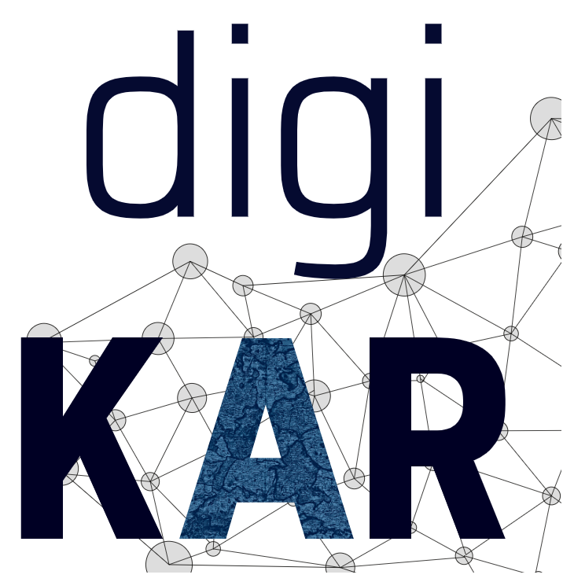

<h2>DigiKAR Projektseminar</h2>

<strong>DE:</strong> Dieses Repositorium enthält Daten und Visualisierungen frühneuzeitlicher Klerikerbiographien. Die Daten wurden von Geschichtsstudierenden der <a href="https://www.uni-mainz.de/">Universität Mainz</a> im Rahmen eines MA-Seminars im Sommersemester 2022 erhoben. Hauptziel des Seminars war es, die Studierenden im Umgang mit historischen Quellen zu schulen und ontologische Probleme zu diskutieren, die sich aus wissenschaftlichen Versuchen ergeben, biographische und räumliche Informationen zu strukturieren und zu normalisieren. Das studentische Projekt ist Teil des <a href="https://digikar.eu/">DigiKAR</a> Geohumanities-Projekts, das räumliche Beziehungen und Mobilität im frühneuzeitlichen Heiligen Römischen Reich experimentell visualisiert.

     
    
    
    
    

<strong>EN:</strong> This repository contains data and visualisations of early modern clerical biographies. The data were collected by students of history at <a href="https://www.uni-mainz.de/eng/">Mainz University</a> as part of an MA seminar in the summer term of 2022. The foremost aim of the seminar was to train the students in working with historical sources and understanding ontological problems arising from researchers' attempts to structure and normalise biographic and spatial information. The student project is affiliated with the <a href="https://digikar.eu/">DigiKAR</a> geohumanities project which experimentally visualises spatial relations and mobility in the early modern Holy Roman Empire.

<table border="0" style="width: 100%" align="center" style="padding: 20px" cellspacing="0" cellpadding="0">
<tr>
    <th style="width:50px"></th>
    <th>Inhalt</th>
    <th>Content</th>
  </tr>
  <tr>
    <td></td>
    <td><a href="https://ieg-dhr.github.io/DigiKAR_Projektseminar/introduction_DE.html">Einführung</a></td>
    <td><a href="https://ieg-dhr.github.io/DigiKAR_Projektseminar/introduction_EN.html">Introduction</a></td>
  </tr>
  <tr>
    <td></td>
    <td><a href="https://ieg-dhr.github.io/DigiKAR_Projektseminar/information_DE.html">Untersuchte Personen</a></td>
    <td><a href="https://ieg-dhr.github.io/DigiKAR_Projektseminar/information_EN.html">Persons studied</a></td>
  </tr>
   <tr>
    <td></td>
    <td><a href="https://ieg-dhr.github.io/DigiKAR_Projektseminar/geocoding_DE.html">Geokodierung</a></td>
    <td><a href="https://ieg-dhr.github.io/DigiKAR_Projektseminar/geocoding_EN.html">Geocoding</a></td>
  </tr>
  <tr>
    <td></td>
    <td><a href="https://ieg-dhr.github.io/DigiKAR_Projektseminar/interactive-map_DE.html">Interaktive Karte</a></td>
    <td><a href="https://ieg-dhr.github.io/DigiKAR_Projektseminar/interactive-map_EN.html">Interactive map</a></td>
  </tr>
  <tr>
    <td></td>
    <td>
     <a href="https://ieg-dhr.github.io/DigiKAR_Projektseminar/Maps1_DE.html">1) Orte der Aufschwörungen</a>  
     <a href="https://ieg-dhr.github.io/DigiKAR_Projektseminar/Maps2_DE.html">2) Kartierung einzelner Biographien</a>  
     <a href="https://ieg-dhr.github.io/DigiKAR_Projektseminar/Maps3_DE.html">3) Gesamtdarstellung der Aktionszentren</a> 
   </td>
    <td>
     <a href="https://ieg-dhr.github.io/DigiKAR_Projektseminar/Maps1_EN.html">1) Places of swearing-in</a>  
     <a href="https://ieg-dhr.github.io/DigiKAR_Projektseminar/Maps2_EN.html">2) Mapping of individual biographies</a>  
     <a href="https://ieg-dhr.github.io/DigiKAR_Projektseminar/Maps3_EN.html">3) General overview of centres of action</a> 
    </td>
  </tr>
   <tr>
    <td></td>
    <td><a href="https://ieg-dhr.github.io/DigiKAR_Projektseminar/network-graph_DE.html">Netzwerkdiagramm</a></td>
    <td><a href="https://ieg-dhr.github.io/DigiKAR_Projektseminar/network-graph_EN.html">Network graph</a></td>
  </tr>
   <tr>
    <td></td>
    <td><a href="https://ieg-dhr.github.io/DigiKAR_Projektseminar/sources_DE.html">Quellen und Literatur</a></td>
    <td><a href="https://ieg-dhr.github.io/DigiKAR_Projektseminar/sources_EN.html">Primary sources and research literature</a></td>
  </tr>
</table> 

<h4>Lehrende / teaching staff</h4>

<em>Seminarleitung und historische Inhalte / course coordination and historical content:</em> <a href="https://neueregeschichte.uni-mainz.de/mitarbeiter/apl-prof-dr-bettina-braun/">Bettina Braun (JGU Mainz)</a> 
<em>Unterstützung der Datensammlung und Bibliographie / data collection support and bibliography:</em> <a href="https://neueregeschichte.uni-mainz.de/florian-stabel-m-a-m-ed-diplom-archivar-fh/">Florian Stabel (JGU Mainz)</a> 
<em>Lehrbeitrag Datenvisualisierung und Kartographie / teaching contribution on data visualisation and cartography:</em> <a href="https://leibniz-ifl.de/institut/personen/moser-jana">Jana Moser (IfL Leipzig)</a> 
<em>Lehrbeitrag QGIS und technische Unterstützung / teaching contribution on QGIS and technical support:</em> <a href="https://github.com/MonikaBarget">Monika Barget (IEG Mainz / Universität Maastricht)</a>  

<h4>Beteiligte Studierende / participating students</h4>

 <table border="0" style="width: 90%" align="center" style="padding: 30px">
  <tr style="width:200px">
    <td>Alina Buchal</td>
    <td>Lara Beringer</td>
    <td>Claudia Dorst Alonso</td>
  </tr>
  <tr style="width:200px">
    <td>Julia Celine Jung</td>
    <td>Lukas Theobald</td>
    <td>Jana Unselt</td>
  </tr>
</table> 

<strong>Kontakt / contact:</strong> 
Constanze Buyken (DigiKAR Projektmanagement / DigiKAR project management) 
digikar@ieg-mainz.de

<figure>
 
<figcaption>Wenzel Hollar: St. Martinsdom in Mainz, pen drawing, 1632, photograph of original work by Stefan Volk, 2015, <a href="https://commons.wikimedia.org/wiki/File:Wenzel_Hollar_Mainzer_Dom_1632.jpg">https://commons.wikimedia.org/wiki/File:Wenzel_Hollar_Mainzer_Dom_1632.jpg</a></figcaption>
</figure> 

