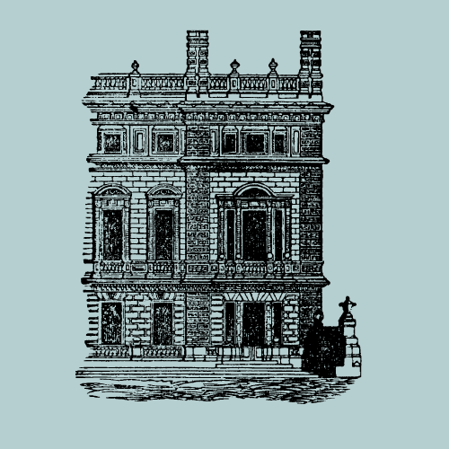

# DigiKAR Projektseminar

<strong>DE:</strong> Dieses Repositorium enthält Daten und Visualisierungen frühneuzeitlicher Klerikerbiographien. Die Daten wurden von Geschichtsstudenten der Universität Mainz im Rahmen eines MA-Seminars im Sommersemester 2022 erhoben. Hauptziel des Seminars war es, die Studierenden im Umgang mit historischen Quellen zu schulen und ontologische Probleme zu diskutieren, die sich aus wissenschaftlichen Versuchen ergeben, biographische und räumliche Informationen zu strukturieren und zu normalisieren.

 

<strong>EN:</strong> This repository contains data and visualisations of early modern clerical biographies. The data were collected by students of history at <a href="https://www.uni-mainz.de/eng/">Mainz University</a> as part of an MA seminar in the summer term of 2022. The foremost aim of the seminar was to train the students in working with historical sources and understanding ontological problems arising from researchers' attempts to structure and normalise biographic and spatial information.

<table style="width:100%">
<tr>
    <th style="width:20%"></th>
    <th>Inhalt</th>
    <th>Content</th>
  </tr>
  <tr>
    <td></td>
    <td><a href="https://ieg-dhr.github.io/DigiKAR_Projektseminar/introduction_DE.html">Einführung</a></td>
    <td><a href="https://ieg-dhr.github.io/DigiKAR_Projektseminar/introduction_EN.html">Introduction</a></td>
  </tr>
  <tr>
    <td></td>
    <td><a href="https://ieg-dhr.github.io/DigiKAR_Projektseminar/information_DE.html">Untersuchte Personen</a>  </td>
    <td><a href="https://ieg-dhr.github.io/DigiKAR_Projektseminar/information_EN.html">Persons studied</a>  </td>
  </tr>
   <tr>
    <td></td>
    <td><a href="https://ieg-dhr.github.io/DigiKAR_Projektseminar/geocoding_DE.html">Geokodierung</a>  </td>
    <td><a href="https://ieg-dhr.github.io/DigiKAR_Projektseminar/geocoding_EN.html">Geocoding</a>  </td>
  </tr>
  <tr>
    <td></td>
    <td><a href="https://ieg-dhr.github.io/DigiKAR_Projektseminar/interactive-map_DE.html">Interaktive Karte</a></td>
    <td><a href="https://ieg-dhr.github.io/DigiKAR_Projektseminar/interactive-map_EN.html">Interactive map</a>  </td>
  </tr>
  <tr>
    <td></td>
    <td><a href="https://ieg-dhr.github.io/DigiKAR_Projektseminar/static-maps_DE.html">
     <a href="./Maps1_DE.html">Orte der Aufschwörungen</a> 
     <a href="./Maps2_DE.html">Kartierung einzelner Biographien</a> 
     <a href="./Maps3_DE.html">Gesamtdarstellung der Aktionszentren</a> </a></td>
    <td><a href="https://ieg-dhr.github.io/DigiKAR_Projektseminar/static-maps_EN.html">
     <a href="./Maps1_EN.html">Places of swearing-in</a> 
     <a href="./Maps2_EN.html">Mapping of individual biographies</a> 
     <a href="./Maps3_EN.html">Overview of centres of action</a> 
     </a></td>
  </tr>
   <tr>
    <td></td>
    <td><a href="https://ieg-dhr.github.io/DigiKAR_Projektseminar/network-graph_DE.html">Netzwerkdiagramm</a></td>
    <td><a href="https://ieg-dhr.github.io/DigiKAR_Projektseminar/network-graph_EN.html">Network graph</a></td>
  </tr>
   <tr>
    <td></td>
    <td><a href="https://ieg-dhr.github.io/DigiKAR_Projektseminar/sources_DE.html">Quellen und Literatur</a></td>
    <td><a href="https://ieg-dhr.github.io/DigiKAR_Projektseminar/sources_EN.html">Primary sources and research literature</a></td>
  </tr>
</table> 

<strong>DE:</strong> Für weitere Informationen zu den historischen Inhalten des Projektseminars wenden Sie sich bitte an <a href="https://neueregeschichte.uni-mainz.de/mitarbeiter/apl-prof-dr-bettina-braun/">apl. Prof. Dr. Bettina Braun</a>.

<strong>EN:</strong> For further information on the historical components of the project seminar, please contact <a href="https://neueregeschichte.uni-mainz.de/mitarbeiter/apl-prof-dr-bettina-braun/">apl. Prof. Dr. Bettina Braun</a>.

<h4>Beteiligte Studierende / participating students</h4>

 <table border="0" style="width:90%" align="center" style="padding: 30px">
  <tr style="width:200px">
    <td>Alina Buchal</td>
    <td>Lara Beringer</td>
    <td>Claudia Dorst Alonso</td>
  </tr>
  <tr style="width:200px">
    <td>Julia Celine Jung</td>
    <td>Lukas Theobald</td>
    <td>Jana Unselt</td>
  </tr>
</table> 

<figure>
 
<figcaption>Wenzel Hollar: St. Martinsdom in Mainz, pen drawing, 1632, photograph of original work by Stefan Volk, 2015, <a href="https://commons.wikimedia.org/wiki/File:Wenzel_Hollar_Mainzer_Dom_1632.jpg">https://commons.wikimedia.org/wiki/File:Wenzel_Hollar_Mainzer_Dom_1632.jpg</a></figcaption>
</figure> 

 

<strong>DE:</strong> Das studentische Projekt ist Teil des <a href="https://digikar.eu/">DigiKAR</a> Geohumanities-Projekts, das räumliche Beziehungen und Mobilität im frühneuzeitlichen Heiligen Römischen Reich experimentell visualisiert.

<strong>EN:</strong> The student project is affiliated with the <a href="https://digikar.eu/">DigiKAR</a> geohumanities project which experimentally visualises spatial relations and mobility in the early modern Holy Roman Empire.

E-Mail: digikar@ieg-mainz.de

Twitter: <a href="https://mobile.twitter.com/digi_kar">@digi_KAR</a>

