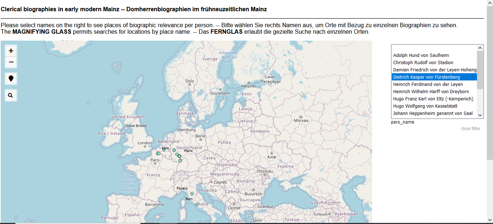

# DigiKAR_Projektseminar

 

This repository contains data and visualisations of early modern clerical biographies. The data were collected by students of history at <a href="https://www.uni-mainz.de/eng/">Mainz University</a> as part of an MA seminar in the summer term of 2022. The foremost aim of the seminar was to train the students in working with historical sources and understanding ontological problems arising from researchers' attempts to structure and normalise biographic and spatial information.

For further information on the historical components of the project seminar, please contact <a href="https://neueregeschichte.uni-mainz.de/mitarbeiter/apl-prof-dr-bettina-braun/">apl. Prof. Dr. Bettina Braun</a>.

 

The student project is affiliated with the <a href="https://digikar.eu/">DigiKAR</a> geohumanities project which experimentally visualises spatial relations and mobility in the early modern Holy Roman Empire.

E-Mail: digikar@ieg-mainz.de

Twitter: <a href="https://mobile.twitter.com/digi_kar">@digi_KAR</a>

<hr2><strong>Contents:</strong></hr2>
 
 
<a href="https://ieg-dhr.github.io/DigiKAR_Projektseminar/readme.html">Home</a>

 
<a href="https://ieg-dhr.github.io/DigiKAR_Projektseminar/geocoding.html">Geocoding</a>

 
<a href="https://ieg-dhr.github.io/DigiKAR_Projektseminar/interactive-map.html">Interactive map</a>

 
<a href="https://ieg-dhr.github.io/DigiKAR_Projektseminar/static-maps.html">Static maps</a>

 
<a href="https://ieg-dhr.github.io/DigiKAR_Projektseminar/network-graph.html">Network graph</a>

<hr2><strong>1st geocoding test and disambiguation issues</strong></hr2>

The collected data refer to biographic events in the careers of several clerics ("Domherren") active in Electoral Mainz. The first geocoding attempt (v1) was carried out in QGIS, using the <a href="https://plugins.qgis.org/plugins/mmqgis/">MMQIGS</a> plug-in and the <strong>Open Street Map / Nominatim</strong> web service for geodata. For 281 entries in the input file, the geocoding API found 1641 results, attributing alternative coordinates to several non-unique place names. This problem generally occurs when geocoding European towns which have "colonial twins" in North America, South Africa or Australia.

View raw file of 1st geocoding attempt: <a href="./GeoJSON%20layers/Domherren_v1_new.geojson">Domherren_v1.geojson</a>

<hr2><strong>2nd geocoding test based on enriched CSV table</strong></hr2>

For the second geocoding test, the input data needed to be enriched and cleaned. In order to improve the automated place-matching, a separate table column named <code>modern_region</code> was introduced to specify in which modern countries (e.g. Germany and France) the places ought to be located. In cases where the country was not immediately clear, <code>Europe</code> was added to at least exclude overseas locations.
 

 

In MMQGIS, both the <code>city</code> and <code>country</code> fields could thus be filled with input data to retrieve better geocoding results (cf. QGIS screenshot above). Out of 281 table entries, 215 could now be matched with a unique location. The entries <em>not</em> geocoded did not contain spatial information in the first place.

Moreover, the four date columns (<code>before</code>, <code>after</code>, <code>start</code>, <code>end</code>) specifying the time-frames of events in the original CSV table were merged into one <code>display date</code> column in order to make creating a chronologically categorised map easier. The more detailed date information, however, has been kept for display in the map labels.

Please view or download the <a href="./CSV%20tables/FactoidList_27Juni2022_enriched.csv">updated data table in CSV format</a> or check the data with coordinates in <a href="./GeoJSON%20layers/Domherren_v2.geojson">GeoJSON format (v2)</a>.

<hr2><strong>1st interactive web map showing places linked with persons</strong></hr2>

The first <a href="https://ieg-dhr.github.io/DigiKAR_Projektseminar/qgis2web_Domherren_v2/index.html">zoomable map</a> based on this GeoJSON file shows each cleric's biographically relevant places in a different colour. The individual layers per person can be (de-)selected in the interactive legend on the right. However, this map needs improvement as points in one place are currently overlapping, so not all relevant events might be visible at all ZOOM levels.

 

