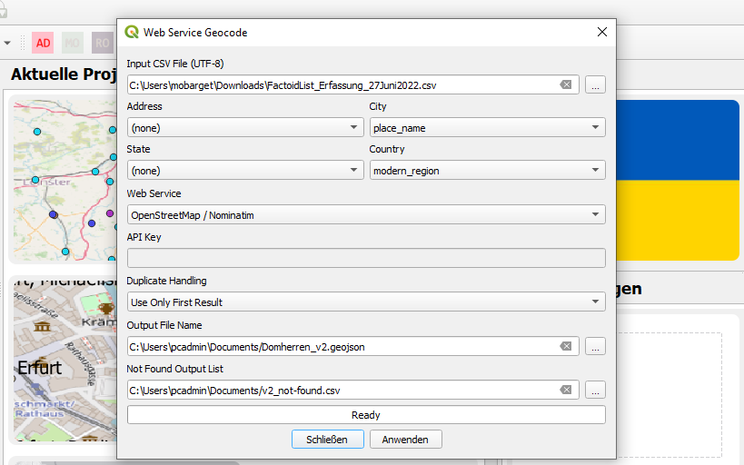

<h2>Geocoding and disambiguation issues</h2>

The collected data refer to biographic events in the careers of several clerics ("Domherren") active in Electoral Mainz. The first geocoding attempt (v1) was carried out in QGIS, using the <a href="https://plugins.qgis.org/plugins/mmqgis/">MMQIGS</a> plug-in and the <strong>Open Street Map / Nominatim</strong> web service for geodata. For 281 entries in the input file, the geocoding API found 1641 results, attributing alternative coordinates to several non-unique place names. This problem generally occurs when geocoding European towns which have "colonial twins" in North America, South Africa or Australia.

View raw file of 1st geocoding attempt: <a href="./GeoJSON%20layers/Domherren_v1_new.geojson">Domherren_v1.geojson</a>

<h2>Improved geocoding based on enriched CSV table</h2>

For the second geocoding test, the input data needed to be enriched and cleaned. In order to improve the automated place-matching, a separate table column named <code>modern_region</code> was introduced to specify in which modern countries (e.g. Germany and France) the places ought to be located. In cases where the country was not immediately clear, <code>Europe</code> was added to at least exclude overseas locations.
 

 

In MMQGIS, both the <code>city</code> and <code>country</code> fields could thus be filled with input data to retrieve better geocoding results (cf. QGIS screenshot above). Out of 281 table entries, 215 could now be matched with a unique location. The entries <em>not</em> geocoded did not contain spatial information in the first place.

In addition, the four date columns (<code>before</code>, <code>after</code>, <code>start</code>, <code>end</code>) specifying the time-frames of events in the original CSV table were merged into one <code>display date</code> column in order to make creating a chronologically categorised map easier. The more detailed date information, however, has been kept for display in the map labels.

Finally, a column to count the overall occurence of each place name in the data set was added. These integers can be used as a <code>weight</code> to define in which size point geometries ought to be displayed in maps.

<h2>Locating abolished institutions / destroyed buildings</h2>

One issue that even enriching the data could not solve, however, is that many early modern (religious) institutions no longer exist today, and that the buildings associated with these institutions have been destroyed. As modern geocoding APIs do not include geodata of past structures, the locations of such places need to be reconstructed from primary sources and secondary works. In the case of our Mainz dataset, neither the Google nor Geonames APIs could find the locations of former <strong>Stift St. Viktor</strong> and <strong>Stift Mariengreden</strong>. Assigning approximate geodata was possible thanks to information provided by <strong>Institut für Geschichtliche Landeskunde</strong> at Mainz University:

<a href="https://www.klosterlexikon-rlp.de/rheinhessen/mainz-st-victor.html">Stift St. Victor</a>
<a href="https://www.klosterlexikon-rlp.de/rheinhessen/mainz-liebfrauen-maria-ad-gradus-mariengreden.html">Liebfrauen - Maria ad gradus - Mariengreden</a>

Please view or download our <a href="./CSV%20tables/DigiKAR_geocoding_Clerics_1August2022.csv">updated data table in CSV format</a> or check the data with coordinates in <a href="./GeoJSON%20layers/Domherren_v4.geojson">GeoJSON format (v4)</a>.

