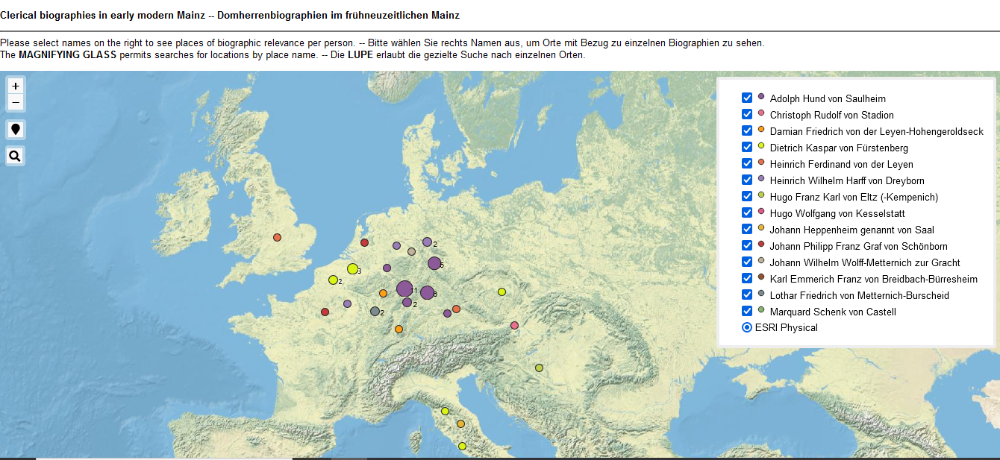

<h2>Interactive web map showing places linked with persons</h2>

Die <a href="https://ieg-dhr.github.io/DigiKAR_Projektseminar/qgis2web_Domherren_v3/#4/51.08/2.07)">zoombare Karte</a>, die auf den angereicherten und bereinigten Daten basiert, zeigt die biografisch relevanten Orte jedes Klerikers in einer anderen Farbe. Die einzelnen Personenebenen können in der interaktiven Legende auf der rechten Seite (de-)selektiert werden. Mehrere Punkte an einem Ort überschneiden sich und werden deshalb geclustert.

