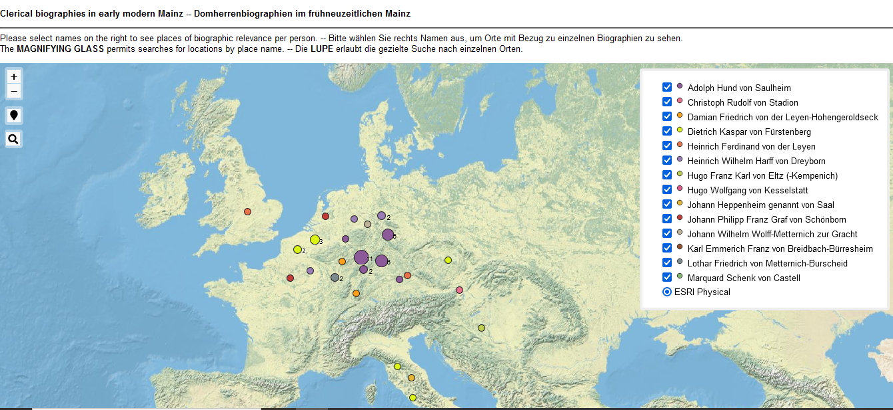

<h2>Interactive web map showing places linked with persons</h2>

The <a href="https://ieg-dhr.github.io/DigiKAR_Projektseminar/qgis2web_Domherren_v3/#4/51.08/2.07)">zoomable map</a> based on the enriched and cleaned data shows each cleric's biographically relevant places in a different colour. The individual person layers can be (de-)selected in the interactive legend on the right. At this stage, the map needs improvement as several points in one place are currently overlapping, so not all relevant events are visible at all ZOOM levels.

