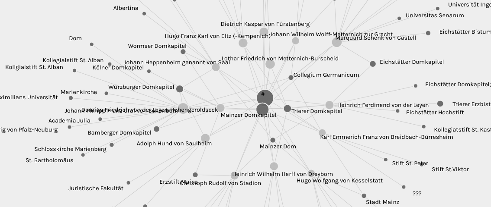

<h2>Darstellung von Verbindungen zwischen Menschen, Orten und Institutionen in Netzwerkdiagrammen</h2>

Das browserbasierte Visualisierungstool <a href="https://hdlab.stanford.edu/palladio/">Palladio</a>, das von der Stanford University zur Verfügung gestellt wird, kann verwendet werden, um mit interaktiven Karten, Zeitleisten und Netzwerkdiagrammen zu experimentieren. Um die Verbindungen zwischen Personen und Orten zu zeigen, müssen die Namen der Personen als <code>source</code> mit den Ortsnamen als <code>target</code> verbunden werden. Im Beispielgraph (Screenshot) hängt die Größe der Ortspunkte von der Häufigkeit der Ortsnamen in den Eingabedaten ab.

Ebenso können Personennamen mit Institutionsnamen aus derselben CSV-Tabelle verknüpft werden, um berufliche Netzwerke hervorzuheben. Um das interaktive Netzwerkdiagramm der Mainzer Geistlichen direkt auf der Palladio-Website zu betrachten, gehen Sie auf <a href="https://hdlab.stanford.edu/palladio-app/#/upload">Load an existing project</a> und fügen Sie die folgende Github-URL hinzu: <a href="https://raw.githubusercontent.com/ieg-dhr/DigiKAR_Projektseminar/main/networks/Network_person-to-institution_1.2.9.json">https://raw.githubusercontent.com/ieg-dhr/DigiKAR_Projektseminar/main/networks/Network_person-to-institution_1.2.9.json</a> Der <code>LOAD</code> Button leitet Sie direkt zur Nutzeroberflache für das Netzwerkdiagramm weiter.

