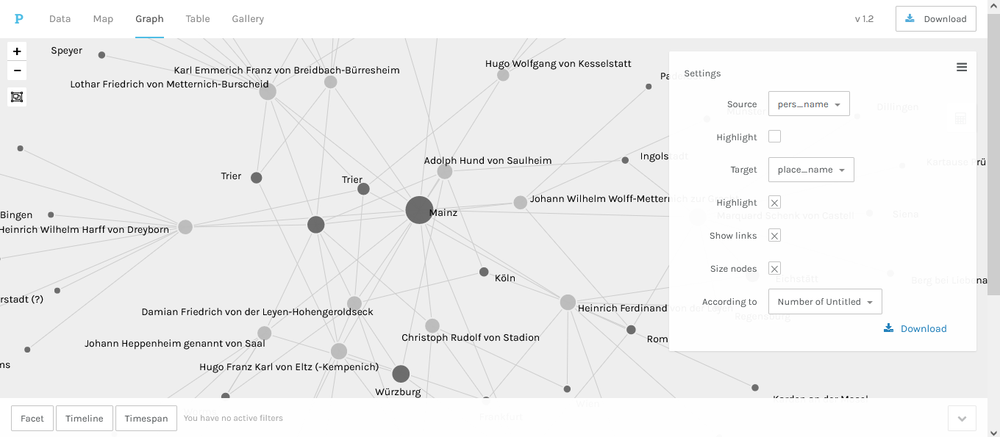
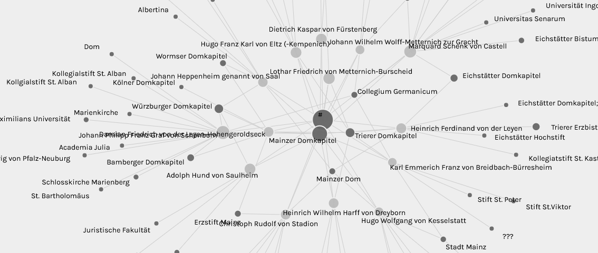

<h2>Displaying connections between people, places and institutions in network graphs</h2>

The browser-based visualisation tool <a href="https://hdlab.stanford.edu/palladio/">Palladio</a>, provided by Stanford University, can be used to experiment with interactive maps, timelines and network graphs. In order to show the connections between people and places, person names need to be selected as <code>source</code> and mapped to place names as <code>target</code>. In the screenshot, the size of the place dots depends on the frequency of the place names in the input data.

Similarly, person names can be linked with institution names from the same CSV table to highlight professional networks. In order to look at the interactive network graph of the Mainz clerics directly on the Palladio website, go to <a href="https://hdlab.stanford.edu/palladio-app/#/upload">Load an existing project</a> and add the following Github URL: <a href="https://raw.githubusercontent.com/ieg-dhr/DigiKAR_Projektseminar/main/networks/Network_person-to-institution_1.2.9.json">https://raw.githubusercontent.com/ieg-dhr/DigiKAR_Projektseminar/main/networks/Network_person-to-institution_1.2.9.json</a> The <code>LOAD</code> button takes you directly to the network graph interface.

