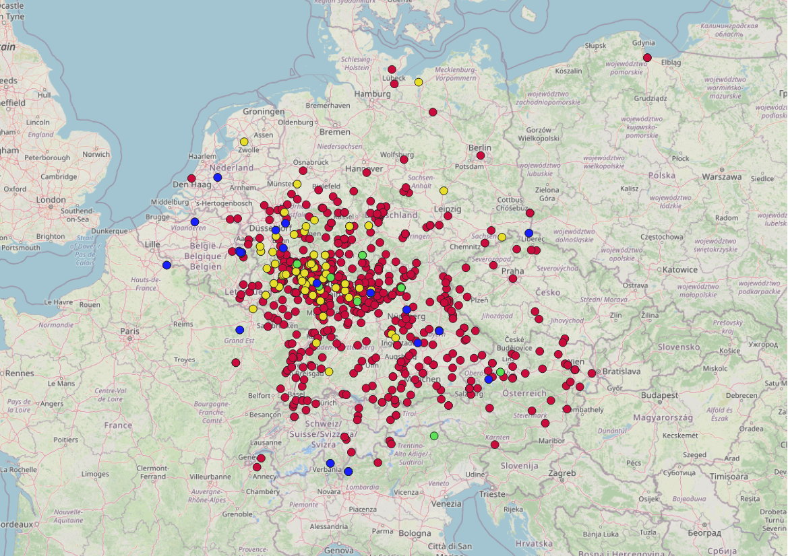
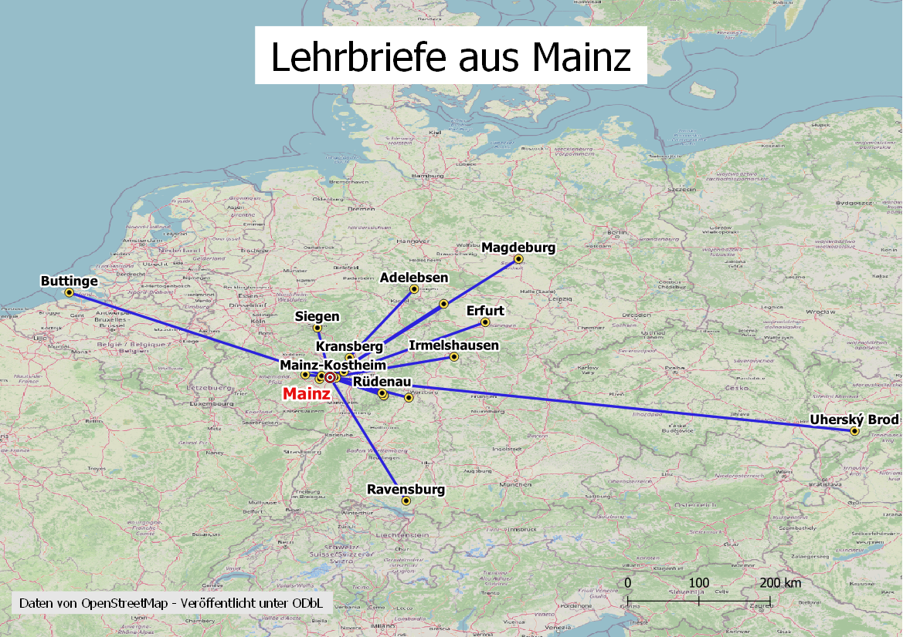

<h2>Static maps highlighting alternative data aspects</h2>

As part of the seminar at JGU Mainz, the participating students were asked to create several static maps highlighting alternative data aspects:

<h4>1) Using colours to illustrate developments over times</h4>

<em>One approach was to visualise event times using the categorised or rule-based colouring of point geometries.</em>

ADD STUDENT MAPS AND MAP DESCRIPTIONS! Lorem ipsum dolor sit amet, consectetur adipiscing elit. Praesent finibus at urna sed gravida. Pellentesque fermentum ligula leo, elementum tincidunt mi sollicitudin quis. Proin vel est id eros efficitur volutpat sit amet at lorem. Aenean eget condimentum arcu, in finibus tellus. Donec efficitur erat nec dolor tincidunt, vitae blandit justo luctus. Phasellus in sagittis mauris. Nam tincidunt, nisi in laoreet tincidunt, elit augue blandit lacus, luctus tempor ex lorem eget est. Donec vel ipsum vitae libero placerat dictum. Vestibulum id risus at dui varius viverra id id est. Mauris vestibulum blandit dolor maximus finibus.

<h4>2) Lines connecting point geometries to illustrate biographic "journeys"</h4>

<em>Another approach was to connect events in one person's biography with straight lines to highlight individual mobility. In QGIS2, the best plug-in for converting point geometries to line geometries was <a href="https://plugins.qgis.org/plugins/pointstopaths_v02/">PointsToPaths</a>, an application developed for wildlife tracking. Unfortunately, this plug-in is no longer available in QGIS3. Alternatively, the <a href="https://plugins.qgis.org/plugins/PointConnector/">PointConnector</a> plug-in can be used. This plug-in, however, requires a separate source-to-target list in CSV or TXT format.</em>

  

<em>The comma separated txt-file (CSV-file) containing the rules need to be formatted like this: <code>[from], [to]</code>. Each row results in a straight line between the two corresponding points.</em>

<strong>Example:</strong>

Stockholm, Paris

London, New York

Paris, London

 

<em>Users with coding skills can write <a href="https://docs.qgis.org/2.18/en/docs/user_manual/plugins/python_console.html">Python scripts</a> to connect point geometries based on rules.</em>

ADD STUDENT MAPS AND MAP DESCRIPTIONS! Lorem ipsum dolor sit amet, consectetur adipiscing elit. Praesent finibus at urna sed gravida. Pellentesque fermentum ligula leo, elementum tincidunt mi sollicitudin quis. Proin vel est id eros efficitur volutpat sit amet at lorem. Aenean eget condimentum arcu, in finibus tellus. Donec efficitur erat nec dolor tincidunt, vitae blandit justo luctus. Phasellus in sagittis mauris. Nam tincidunt, nisi in laoreet tincidunt, elit augue blandit lacus, luctus tempor ex lorem eget est. Donec vel ipsum vitae libero placerat dictum. Vestibulum id risus at dui varius viverra id id est. Mauris vestibulum blandit dolor maximus finibus.

<h4>3) Point clustering to show centres of action</h4>
<em>The third visualisation option used <em>point clustering</em> to show the overall density of biographic events in the mapped places.</em>

The map above shows all places in the collected dataset as coloured clusters. The largest dots, displayed in purple, indicate place names that are disproportionately frequent in the data.

